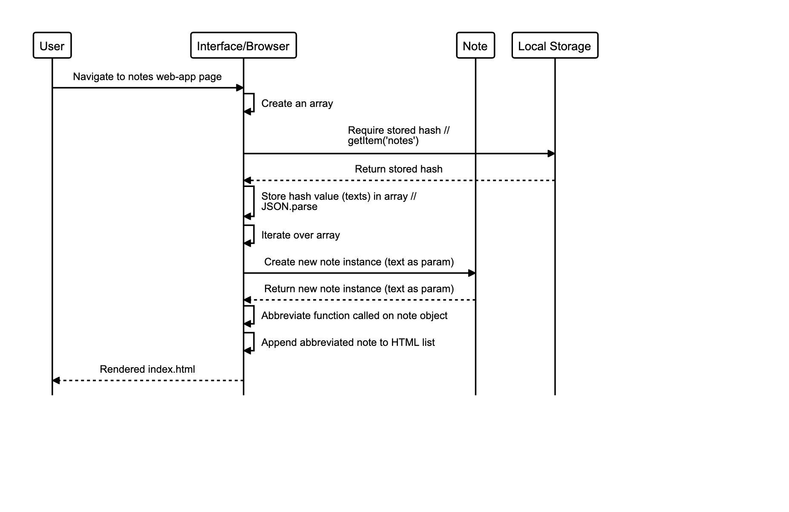
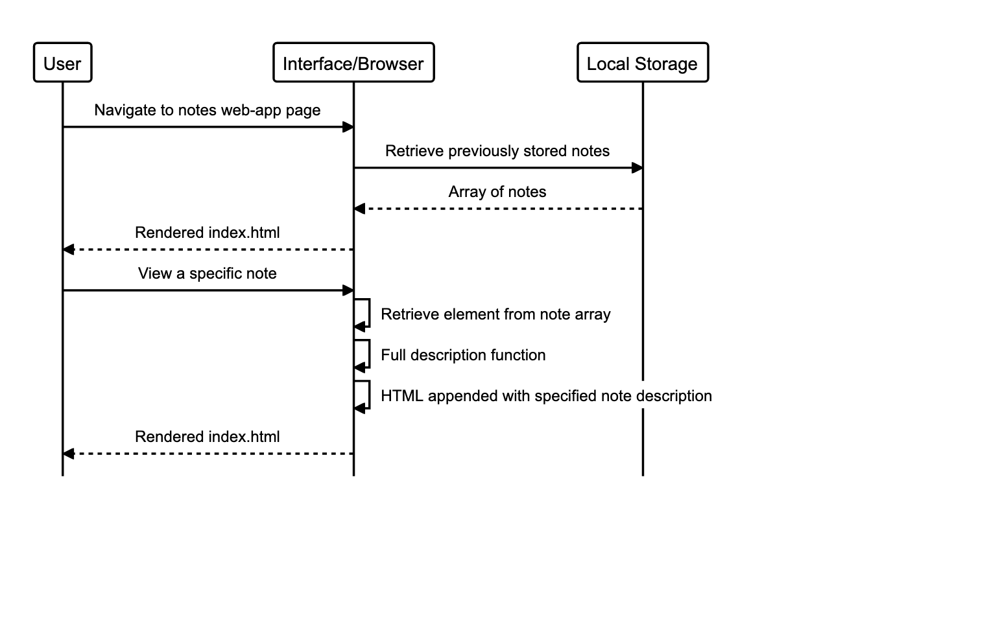
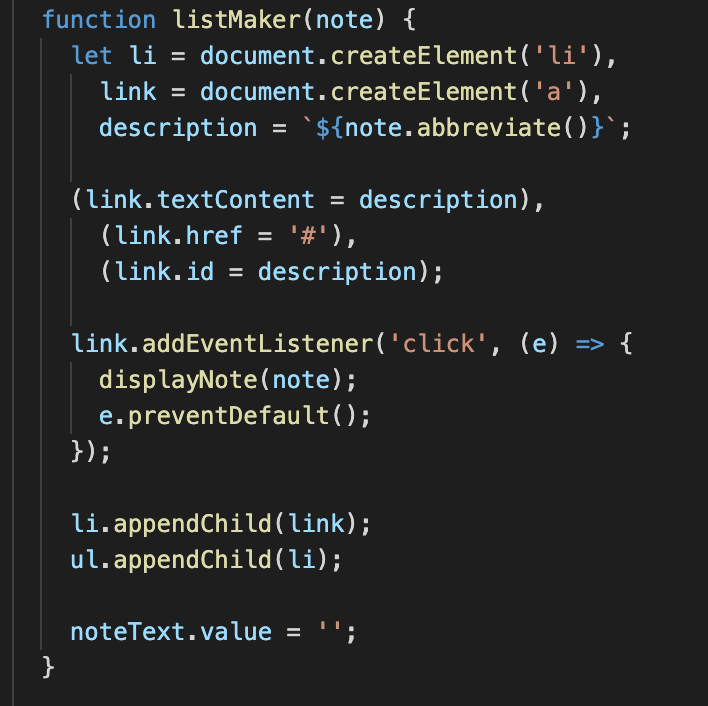

# Notes App

A single-page web app to make, alter and store notes.

## 👀 Live demo

**[Check it out here.](#)** You can change create a note, view or remove a note.

## 🏁 Getting Started

To run locally:

Get a copy of the Note app running on your local machine (for playing around, testing or development).

```sh
git clone git@github.com:jasonrowsell/notes-app
```

run the app locally from terminal

```sh
cd notes-app
http-server ./public
```

At this point the application should be running on your machine at [127.0.0.1:8080](http://127.0.0.1:8080/)

## Built Using

- HTML
- CSS
- JavaScript

## Brief

### Requirements

The project challenge requires the programmer to:

- Create a single-page web app.
- Build the program without using any external libraries, such as jQuery, Jest.
- Request and use data from an external API.
- Develop the app through TDD with a your own test library in JavaScript.

### User Stories

```
As a programmer
I can see a list of my notes, where each note is abbreviated to the first 20 characters
So I can find the one I want
```

```
As a programmer
I can create a new note
So I can record something I need to remember
```

```
As a programmer
I can see the full text of an individual note on its own page
So I can see all the information in the note
```

```
As a programmer
I can use shortcodes like `:fire:` that get converted into emojis like 🔥
So I can record notes with fun little pictures
```

```
As a programmer
I can delete notes once I no longer need them
So that I can stay organised
```

## Planning

### Sequence Diagrams

**Adding a new note**

Once the text value has been inputted and submitted to the interface, this text is pushed into an array. The array is then set to be the value of a hash which is then stored in localstorage. This hash will be retrieved at the start of each session and evaluated to display each note (covered below). To display the created note during the current session, a note instance is created with the parameter of the text value. The abbreviate function is called on the note object and the value returned from this is appended to a list tag in the index.html. This is then rendered for the user.


**Viewing all notes**

**Vewing a full note**


### Code Snippets

**_Viewing a note's full description_**

Without creating paths to new pages in order to click on a note to view it's full description, information must be appended to the current page. When designing a function to create a note, we appended an anchor element `a` to a list element `li`, to an unordered list `ul`. The anchor tag provides opportunity to structure a DOM event, to initiate an appendment of the note's full description to the body.



Having this DOM event inside the function allows each link to reference its own note object passed into the function, this irradicates necessity for GET requests and alternate routes.
