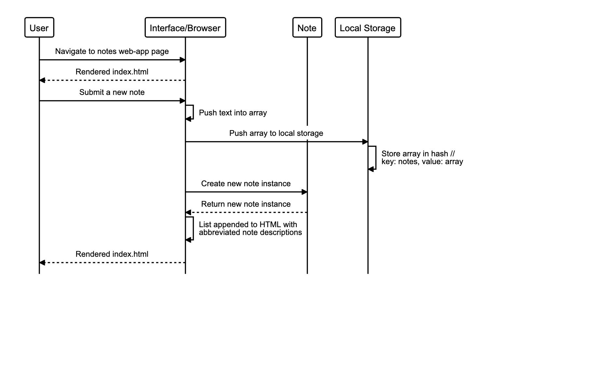

# Notes App

A single-page web app to make, alter and store notes.

## 👀 Live demo

**[Check it out here.](#)** You can change create a note, view or remove a note.

## 🏁 Getting Started

To run locally:

Get a copy of the Note app running on your local machine (for playing around, testing or development).

```sh
git clone git@github.com:jasonrowsell/notes-app
```

open the html file from terminal

```sh
cd notes-app
http-server ./public
```

At this point the application should be running on your machine at [127.0.0.1:8080](http://127.0.0.1:8080/)

## Built Using

- HTML
- CSS
- JavaScript

## Brief

### Requirements

The project challenge requires the programmer to:

- Create a single-page web app.
- Build the program without using any external libraries, such as jQuery, Jest.
- Request and use data from an external API.
- Develop the app through TDD with a your own test library in JavaScript.

### User Stories

```
As a programmer
I can see a list of my notes, where each note is abbreviated to the first 20 characters
So I can find the one I want
```

```
As a programmer
I can create a new note
So I can record something I need to remember
```

```
As a programmer
I can see the full text of an individual note on its own page
So I can see all the information in the note
```

```
As a programmer
I can use shortcodes like `:fire:` that get converted into emojis like 🔥
So I can record notes with fun little pictures
```

```
As a programmer
I can delete notes once I no longer need them
So that I can stay organised
```

## Planning

### Sequence Diagrams

**Adding a new note**

**Viewing all notes**

**Deleting a note**

**Vewing a full note**

